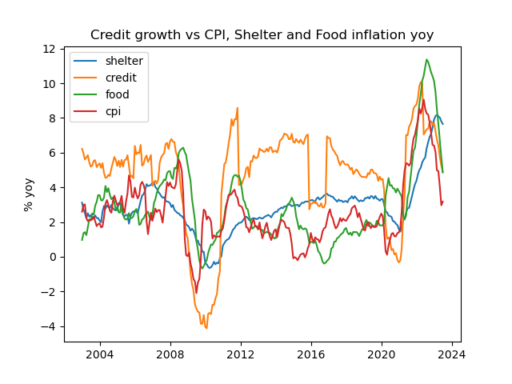
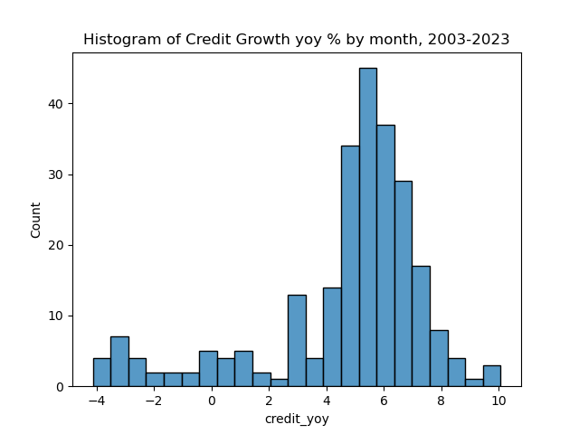
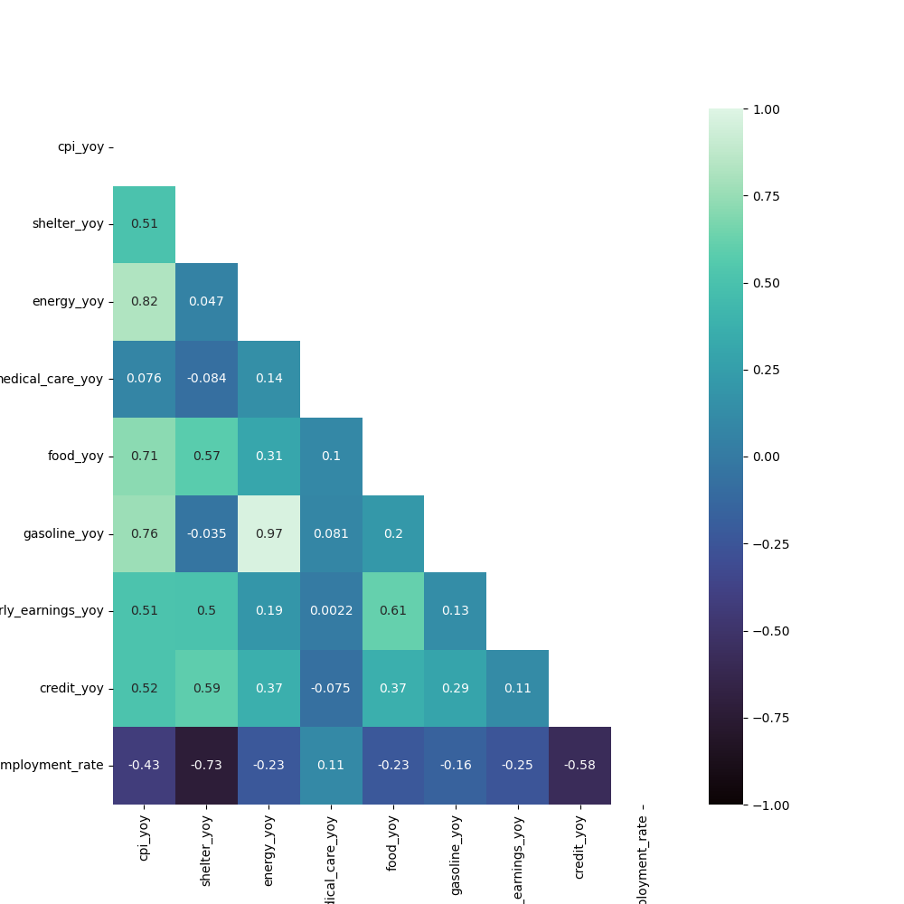

# Credit Catastrophe or Consultancy
### Project 5 by Aaran Daniel, Steven Goulden, and Bejamin Wolff for General Assembly's DSI
Due: Tuesday, February 20th, 2024 at 9 AM ET

## Table of Contents

-Problem Statement 
-Technology Requirements 
-Data Acquisition 
-Executive Summary 
-Conclusion 
-Sources 
-Credits 

## Problem Statement
In such turbulent times when nothing is sure anymore, a leading credit agency in the United States has engaged our consulting team to analyze credit market trends, with a focus on identifying factors affecting delinquency rates and credit growth. Our task is to forecast these metrics for the upcoming year and identify any significant seasonal or cyclical trends that impact the financial cycle. This analysis aims to pinpoint optimal periods for low-risk lending. Targeting banks and policymakers, the project prioritizes clarity and succinctness in presenting actionable insights.
Banks and policy makers are the designated target audience for this study.

## Question:
What do the next 12 months look like for lenders in the US?

## Order of Workflow: 
**Data and Cleaning files:**  
AD: 01_cleaning_acd.ipynb 
AD: 02_cleaning_acd 2.ipynb 
BW: 03_data_gathering.ipynb 
BW: 04_de_ii.ipynb 
**EDA:** 
AD: 05_eda_inflation_credit_acd.ipynb 
AD: 06_eda_tax_gov_benefits_acd.ipynb 
BW: 07_eda_iii.ipynb 
SG: 08_EDA_U_Shelter_Energy_Food_Wages_SG.ipynb 
SG: 09_Shap_analysis.ipynb 
**Modelling:** 
AD: 10_modelling_ACD.ipynb 
BW: 11_modelling_i.ipynb 
BW: 12_modelling_ii.ipynb 

## Technology Requirements:
Maplotlib 3.7.2
Numpy 1.24.3
Pandas 2.0.3
Pmdarima 2.0.4
Scikit-learn 1.3.0
Seaborn 0.12.2
Statsmodels 0.14.0
Sys 

## Data Sources: 
We primarily used US government economic data from the following sources.
- Bureau of Labour Statistics (bls.gov)
- Bureau of Economic Analysis (bea.gov)
- New York Fed
- St Louis Fed/ Federal Reserve Economic Data
- Fed Reserve Board
The data was reliable and clean, but much of it was only available on a quarterly basis and given the relatively short length of available data (post 2000), we had to use monthly data in order to have a sufficiently large dataset. As such, we had to interpolate (ie create entries from Q1 to Q2 using April = March + ((Q2-Q1)/3) between quarterly data to create monthly comparable entries.
We used the BLS and BEA API and manually downloaded the data from the NY and St Louis Fed manually in csv format.

## Executive Summary
For the sake of simplicity General Assembly EDA section is itemize by each participant's work.

### Cleaning: 
**ACD & SG**:
- Cleaned data from Bureau of Labour Statistics, plotting distributions
- Cleaned Bureau of Economic Analysis data which contained monthly information on income, tax, benefits and savings for the US economy wide.
- Cleaned credit card delinquency, credit card balances and 30 year mortgage data.
- Cleaned FRB monthly consumer credit data.
- Combined all the above into one master data frame.
**BW**L
- Ensure that quarterly data remained distinct from monthly data, feeling it disengious and straying from the original data science project to linearly interpoltate between quarterly dates to theoetically get a more robust dataset. However, such changes are local to the relevant notebook.

### EDA:
**ACD:**
- CPI is slightly left-skewed, centered around a mean of 2.53%, slightly above the FED's target of 2%.
- GDP has an annual average of 4.37%, with a range from -6.9 to 17%. There was a significant drop in GDP growth due to COVID, followed by a recovery from mid-2020 through early 2021.
- The Fed Funds rate has a median of 1% - the 'zero interest rate policy (ZIRP) era' - with a maximum of 5.98% observed in the analyzed period.
- Beginning in early 2022, the Fed started to hike rates to highs not seen since the 2008 crisis.
- Median annual disposable income is $41,000 (chained to 2017 dollars).
- The top 4 variables most correlated with credit growth are measures of inflation, including CPI itself, followed by 30-year mortgage rates.
- The unemployment rate has a -0.55 correlation with credit growth, as expected, since lower unemployment means more people have access to credit due to reliable income streams.
- 90-day delinquency rates on credit cards show the highest rates in NV, FL, PR, TX, AZ, CA, SC, MS, all over 10% for the last 20 years, while the lowest are in IA, UT, VA, WA, MN, SD, NE, WI, AK, ND, all below 7%.
- States with the highest variance in 90-day delinquency are NV, FL, CA, PR, and the lowest variance in SD, WY, NM, AK.
- Total taxes saw notable falls in 2009 after the credit crunch and due to COVID in 2020.
- Total government benefits have outliers with benefits reaching $8.1 trillion in some months, due to high outliers in Unemployment Insurance, with abnormal payments authorized during COVID lockdowns.
- Social Security makes up the bulk of government social benefits, with a median of $5.5 trillion per month - 22% of tax revenue and one-third of all government social benefit spending.
- Unemployment insurance has a median of $34 billion/month, with COVID highs of $1.434 trillion in July 2020, $1.368 trillion in June 2020, and $1.116 trillion in May 2020.
- Veterans benefits average $69 billion monthly, with a minimum of $26 billion and a maximum of $173 billion.
- Taxes are negatively correlated with credit card delinquency; as tax revenues increase, credit card delinquency falls.
- There appears to be an inverse relationship between savings as a percentage of disposable income and year-over-year credit growth, with a -31% correlation.
   
**SG**
- We then looked at credit growth against CPI and its key components and it was interesting to see a clear positive correlation. This made broad intuitive sense as credit generally grows during periods of economic expansion, when inflation tends to be higher. 

- We then looked at some scatter charts of credit growth versus 1) unemployment, which was negatively correlated, as one would expect (people do not tend to borrow more during recessions, or at least credit is not as readily available) and 2) the savings rate, which showed a weak negative relationship. This was largely impacted by the COVID period, during which time the personal savings rate spiked (as people were not spending), but other than that the savings rate tended to be fairly stable at 2-10%, with clustering around the 4-6% level. Similarly, annual credit growth tended to be clustered in the 4-8% range, slightly ahead of nominal GDP, which broadly makes sense. This was evident in the histograms for both features. 

- We then used domain knowledge to select a relevant feature set and looked at a pair grid and correlation matrix. As expected, inflation was heavily linked to credit growth, and interestingly far more so than employee compensation. Also, medical care generally had a negative correlation with credit growth. We removed energy as it was highly correlated with gasoline. 

**BW**
Of worthiness for an Executive Summary is limited to BW's 'eda_i.ipynb'. Principal findings include the following:
- Around 30 features are highly positively correlated with each other (two of which are negative; the rest positive), being defined with a correlation of at least .5. This would imply an overwhelming 'domino effect' of one thing falling after another. With our current analysis, it is too premature to focus on one 'cause' feature, if there is one at all.
- The major focus of BW was spent on trying to analyze delinquency rates. Astonishingly, aside from the 30 and 90 day rates being incredibly close together (.96; which makes sense, basically suggesting that people that don't pay off their bills within 30 days probably still won't have them paid in 90 days), only one other feature was found to be significant (see above) - the year-over-year car consumption rate (interestingly negative). Another close second, being below the threshold for significance, was the federal funds rate at .48. Despite attempts to transform the data via root or logistic relationships, trends remained the same. So, it emerged that basically all features have nothing to do with delinquency rates (see below for more on this).

### Forecasting Credit Growth - SARIMAX Model (ACD):
- Modelled with test split of 0.15% which equates to circa 3.5 years our of 23. Starting the predictions in 2020-07-01 - 5 months after the start of covid. 
- Built baseline ARIMA model with no exogenous variables and no hyper parameter tuning. Model was poor at fitting trend of data. AIC = 506.
- Including hyper parameter tuning (via auto_arima) saw some minor improvement in model performance. AIC = 503.
- Including Exogenous variables allowed model visually to model the trend much better and achieve AIC 498.3334941164123 with Root Mean Squared Error: 0.94.
- Tried modelling with smaller training set allowing us to see the models performance in pedicting from pre covid forwards. 
- As might be expected the models performance worsens when provided with less training data. 2% less in this case. Which brings the train period to before covid. 
-  Given an exceptional economic and cultural shock like covid, the model might be expected to have unaccurate predictions. 
- We see the model predicting a huge fall in credit growth from Feb 1st 2020.
- Then forecasted 12 months into the future using the model created. 
- Based on our forecast credit growth is expected to fall into negative levels over the next 12 months perhaps levelling out towards the end of the year. 
- Although perhaps we cannot completely trust the amplitude of the forecasts, we have seen that the model even when predicting precovid is largely directionally correct. 
- On this basis we would advice the credit card company we are consulting to plan for negative credit growth over the coming 12 months. 

### Forecasting 90 Day Credit Delinquency - SARIMAX Model (BW):
BW focused on modeling delinquency rates, 30 and 90, with SARIMAX models, with the accompanying work found in his 'modeling_ii.ipynb'. Without even the presence of any exogenous (outside) variabls besides the flow of time and the delinquent rates, models were found to be accurate within .014 and .0218 of the mean absolute percentage error of the actual delinquency rates and later visually confirmed for accuracy.
Attempts were made to try to improve their accuracy by the addition of exogenous features (external features to our target that still effect its performance over time). However, no feature within the current dataset was found to be significant to further understanding of delinquency rate change. The bright side, however, is that this was already hinted at by the EDA stage when essentially no significant correlation the delinquents had with the numerous features.
-Perplexingly, even yoy car consumption rate, despite its high correlation, did not improve accuracy. However, even this is somewhat understood via an earlier modling attempt ('modeling_i.ipynb') where via recursive feature elimination (RFE) this feature was one to be eliminated, implying a weak impact for whatever reason.
It was debated to try a VAR model to graph both simultaneously, however ultimately rejected when defnitionally 90 day delinquents must first be 30 day delinquents.

### Modeling Credit & Delinquency - Linear Regression, SVR, Random Forests (SG)::
- We then built our first model to predict credit growth and for Lasso and Ridge linear regression and achieved a cross validation score of 0.5, with random forests achieving 0.83 and SVR achieving 0.89
- We can see that as credit card rates have been rising over the last 10 years, this in conjunction with higher balances has driven a significant increase in annual credit card servicing costs. The same can be said for mortgage servicing costs. 

- We then built a model to predict delinquent credit, as defined by 30 and 90 days late. We could predict this from current macro data with a cross val score of 0.86 on current data, using random forests.
- But the aim was to be able to predict 6 or 12 months forward so that the credit card company would know when growth was picking up but also would be able to identify low quality growth, ie periods of worsening credit quality.
- We achieved the best results with SVR, with a cross val score of 0.82 for 12m forward 30 day delinquencies and 0.83 for 12m forward credit growth. 

- Based on July data, which was the last date in our data set, the model predicted a decline in credit growth to 4.3% (from 4.9%) and 30 day delinquencies to 2.34% (from 3.2%) in July 2024.
- We also used PCA for dimensionality reduction given there were relatively limited rows. This made little difference to our delinquency model but resulted in a far worse credit growth model
- Lastly we tried to create a metric for good vs bad credit growth. The point being that a credit card company would ideally like to expand credit into an environment of growth in credit and declining 30/90 day delinquencies.¶
- Overall, we can see that delinquencies tend to grow during times of credit, with something of a lag and so it is very difficult, if not impossible to identify periods of 'good' credit growth.

- With more work we could analyse the profitability of expansion, despite worsening credit, because the company is currently charging rates of over 20% and so an incremental 1% charge off likely makes good business sense. With that analysis, we could decide how to allocate credit most effectively, in terms of deciding what would be profitable lending, on a case by case, or perhaps group by group basis. This would probably be an interetsing use case for k-means clustering or DB-SCAN, if we had customer level data.
- Lastly, we did some SHAP analysis to understand the impact of individual features. What stood out was the importance of credit card payment growth on delinquent credit, along with the negative impact of earnings growth. CPI tended to go hand in hand with worse credit, as we saw earlier as CPI correlates well to credit growth, which generally leads worsening credit standards

- For credit growth, the SHAP analysis showed that wage and price inflation were the major drivers.

## Findings:
- We found GDP growth in the last 22 years to be a 4 month lagging indicator of credit growth. Particularly in periods of falling economic growth they are highly correlated at 62% correlation so when GDP growth is slowing we suggest you plan for a reduction in credit.
- On a state level low risk states identified as ['NE', 'VA', 'IA', 'ND', 'AK', 'SD'], in both the 10 lowest varience in delinquency and 10 lowest total delinquency. 
- High risk states identified as ['NV', 'FL', 'CA', 'PR', 'AZ', 'MS', 'TX', 'SC'], those in group 10 highest varience and in 10 highest delinquency. 
- Unemployment insurance, and all kinds of benefits are correlated with falls in credit growth. 
- We might suggest lobbying for free market solutions to consumer troubles as opposed to government intervention in the form of benefits. (Though this might be explained by slowing economic contains and may not be causal it certainly wouldn’t hurt to encourage the use of credit facilities.)
- Taxes negatively correlated with credit card delinquency, as tax revenues increase credit card delinquency falls. This is likely due to pro-cyclical forces.
- We suggest planning for a fall in credit growth over the next 12 months, in a relatively high interest rate environment this should be considered to be potentially persistent low credit growth until rates are lowered. 
- Plan for a potential rise in delinquencies over the next 12 months.
- Our findings saw that rarely do you see increasing credit growth without a rise in delinquencies. This was found time and time again throughout our EDA. *Apart from one Goldilocks period, post credit crunch, where banks were extremely adverse to lending in the wake of the financial crisis. This meant that credit worthly lenders were for a short period underserved. 

## Recommendations:
- Be selective and conservative with new lending over coming 12 months.
- Restrict lending to new/ lower quality borrowers
- Credit availability should be focused on existing, low risk borrowers
- Increase lending rates to offset higher delinquencies

## Conclusion
Our client should expect a difficult lending environment in the coming months with a number of factors coming to gether at once. Our forecasting predicts delinquent rates are going up, a sign that more people are unable to pay their credit card bills and a prudent thing to do would be to raise interest rates and not be as open to lending money to others given the default greater risk. Furthermore we have found that in conjunction credit growth is likely to fall in the next 12 months.

## Sources:
**Data:**
- [Federal Reserve Economic Data - FRED](https://fred.stlouisfed.org/)
- [St. Louis Federal Reserve](https://www.stlouisfed.org/)
- [Bureau of Economic Analysis (BEA)](https://www.bea.gov/)
- [FEDFUNDS Series at FRED](https://fred.stlouisfed.org/series/FEDFUNDS)

**Other:**
- [Policy Basics: Where Do Our Federal Tax Dollars Go? - CBPP](https://www.cbpp.org/research/policy-basics-where-do-our-federal-tax-dollars-go)
- [Getty Images: Crying Baby in Office](https://www.gettyimages.com/photos/crying-baby-office)
- [Joint Statement of Janet L. Yellen, Secretary of the Treasury, and Shalanda D. Young, Director of the Office of Management and Budget on Budget Results for Fiscal Year 2023 - White House](https://www.whitehouse.gov/omb/briefing-room/2023/10/20/joint-statement-of-janet-l-yellen-secretary-of-the-treasury-and-shalanda-d-young-director-of-the-office-of-management-and-budget-on-budget-results-for-fiscal-year-2023/)
- [How to Convert DateTime to Date in Pandas - GeeksforGeeks](https://www.geeksforgeeks.org/how-to-convert-datetime-to-date-in-pandas/)
- [Introduction to SHAP Values (Machine Learning Interpretability) - DataCamp](https://www.datacamp.com/tutorial/introduction-to-shap-values-machine-learning-interpretability)
- [Using SHAP Values to Explain How Your Machine Learning Model Works - Towards Data Science](https://towardsdatascience.com/using-shap-values-to-explain-how-your-machine-learning-model-works-732b3f40e137)
- [Average Household Debt - The Ascent by Motley Fool](https://www.fool.com/the-ascent/research/average-household-debt/)
- [Consumer Debt Study - Experian](https://www.experian.com/blogs/ask-experian/research/consumer-debt-study/#:~:text=The%20total%20U.S.%20consumer%20debt,increase%20from%202021%20to%202022.)
- [NumPy sqrt in Python - GeeksforGeeks](https://www.geeksforgeeks.org/numpy-sqrt-in-python/).
